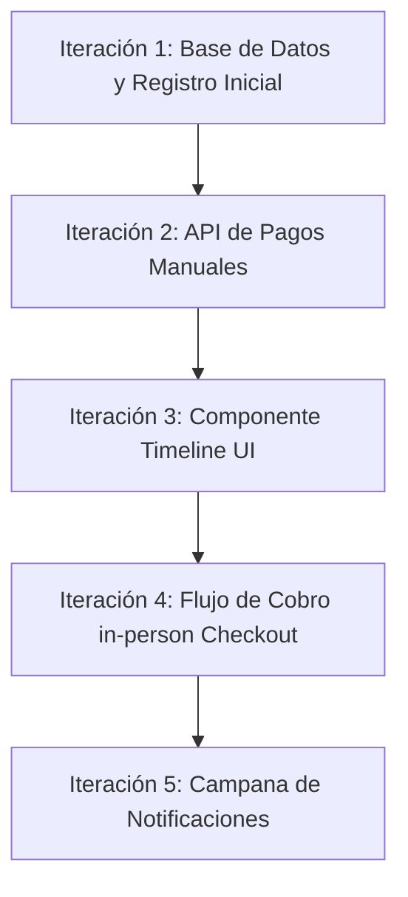

# Plan de Implementación Iterativo: Ciclo de Vida de Citas, Pagos B2C y Notificaciones

Este plan propone resolver la integración de pagos B2C y las notificaciones del Dashboard en **5 iteraciones controladas**. Se unifica la nomenclatura de los estados para evitar discrepancias lógicas entre la Base de Datos, el Backend y el Frontend (`SegmentedControl`, Agenda y Timeline).

---

## 1. Nomenclatura Unificada de Estados

Para evitar confusiones, alineamos los términos de la base de datos (claves en inglés) con los de la interfaz de usuario (etiquetas en español):

### A. Estados de la Cita (Operativo - `Booking.status`)
*   `pending` ➔ **Pendiente** (Cita puesta en espera de confirmación).
*   `confirmed` ➔ **Confirmada** (Cita aprobada y agendada).
*   `completed` ➔ **Completada** (Servicio prestado físicamente al cliente).
*   `cancelled` ➔ **Cancelada** (Cita anulada por inasistencia o cancelación del cliente).

### B. Estados del Pago (Financiero - `Payment.status`)
*   `pending` ➔ **Pendiente** (Cobro pendiente).
*   `paid` ➔ **Pagado** (Ingreso recibido).
*   `refunded` ➔ **Reembolsado** (Dinero devuelto en cancelaciones).
*   `failed` ➔ **Fallido** (Error en pasarela digital).

---

## 2. Reglas de Negocio, Auditoría y Seguridad (Puntos Críticos)

Tras realizar una auditoría arquitectónica del sistema, se anexan las siguientes reglas obligatorias para evitar vulnerabilidades y fallos operativos:

1.  **Seguridad en el Cobro Manual (Autorización):**
    *   El endpoint `POST /api/v1/bookings/{booking_id}/pay` debe estar estrictamente protegido. 
    *   **Regla:** Solo el dueño del negocio (`current_user.id == business.owner_id`) o los colaboradores autorizados de esa sucursal pueden invocar el registro de pago manual. Un cliente B2C **nunca** debe poder marcar su propia cita como pagada de forma manual en el servidor.
2.  **Manejo de Tiempos con Zona Horaria Local (Timezones):**
    *   Las columnas de auditoría temporal (`created_at`, `confirmed_at`, `completed_at`, `cancelled_at`, `paid_at`) deben declararse como `DateTime(timezone=True)` en SQLAlchemy para evitar desfases horarios si el servidor está en una zona horaria distinta a la del negocio.
3.  **Comportamiento de Pagos ante Cancelaciones:**
    *   Si una cita pasa a `"cancelled"`:
        *   **Si el pago estaba `"paid"` (Online):** Mantener el pago como `"paid"` por defecto (política de retención por cancelación tardía). Se debe dar la opción en el backend para cambiarlo a `"refunded"` si se hace un reembolso manual.
        *   **Si el pago estaba `"pending"`:** Se mantiene en `"pending"` (el dinero nunca entró).
4.  **Mitigación de Contaminación de Alertas:**
    *   Para evitar que citas muy antiguas (olvidadas por el negocio) contaminen la campana de notificaciones por siempre, el endpoint de alertas (`GET /alerts`) solo listará citas pasadas sin completar correspondientes a los **últimos 7 días**.
5.  **Registro de Inasistencias (No-Show):**
    *   Cuando el empresario seleccione "No Asistió" en la campana de notificaciones o en el drawer, la cita cambiará su estado a `"cancelled"`, y automáticamente se agregará al campo de texto de `notes` de la cita una marca indicando: `"[Sistema] Cancelada por inasistencia del cliente"`. Esto permite mantener el historial sin necesidad de crear un estado nuevo en la base de datos.

---

## 3. Iteraciones de Desarrollo

---

### 🟢 Iteración 1: Base de Datos, Auditoría de Tiempo y Pagos Pendientes
**Objetivo:** Preparar la base de datos para almacenar el historial de tiempos de la cita y asegurar que cada cita nueva inicie con un pago pendiente registrado.

*   **Paso 1.1 (Modelos Backend):**
    *   En [booking.py](file:///c:/Users/development/Documents/visual/citas/backend/app/models/booking.py), añadir columnas de marcas de tiempo:
        *   `created_at: Mapped[datetime] = mapped_column(DateTime(timezone=True), server_default=func.now(), nullable=False)`
        *   `confirmed_at: Mapped[datetime | None] = mapped_column(DateTime(timezone=True), nullable=True)`
        *   `completed_at: Mapped[datetime | None] = mapped_column(DateTime(timezone=True), nullable=True)`
        *   `cancelled_at: Mapped[datetime | None] = mapped_column(DateTime(timezone=True), nullable=True)`
        *   `paid_at: Mapped[datetime | None] = mapped_column(DateTime(timezone=True), nullable=True)`
*   **Paso 1.2 (Migración):**
    *   Generar y aplicar la migración de Alembic para actualizar la base de datos.
*   **Paso 1.3 (Service de Citas):**
    *   En [booking_service.py](file:///c:/Users/development/Documents/visual/citas/backend/app/services/booking_service.py), actualizar la creación de cita (`create_booking`) para que instancie automáticamente un registro `Payment` asociado con:
        *   `amount = service.price`
        *   `status = "pending"`
        *   `payment_method = "pending"`

---

### 🟢 Iteración 2: API de Pagos B2C Manuales en Sucursal
**Objetivo:** Permitir al backend recibir cobros de citas y registrar el método de pago presencial bajo controles de seguridad.

*   **Paso 2.1 (Endpoint de Pago):**
    *   Crear la ruta `POST /api/v1/bookings/{booking_id}/pay` en [bookings.py](file:///c:/Users/development/Documents/visual/citas/backend/app/routers/bookings.py).
    *   Debe recibir el método de pago seleccionado (`payment_method`: `"cash"`, `"credit_card"` o `"transfer"`).
    *   **Seguridad:** Validar que el `current_user` sea el dueño del negocio.
    *   Acción: Buscar el `Payment` de la cita, cambiar su estado a `"paid"`, asignarle el método de pago correspondiente y actualizar `Booking.paid_at = datetime.now()`.
*   **Paso 2.2 (Esquemas de Entrada/Salida):**
    *   Asegurar que `BookingRead` retorne la relación del pago y las nuevas marcas de tiempo (`confirmed_at`, `completed_at`, `paid_at`, etc.).

---

### 🟢 Iteración 3: Componente Timeline/Stepper Visual (Frontend)
**Objetivo:** Dibujar la línea de progreso vertical en el detalle de la cita usando la estética premium de la imagen de referencia.

*   **Paso 3.1 (Componente ProgressLine):**
    *   Crear `<ProgressLine booking={booking} />` en el frontend utilizando Tailwind CSS v4 y Framer Motion para transiciones suaves.
    *   **Nodos del Stepper:**
        1.  **Creada (Pendiente):** Activa siempre que exista `created_at` (muestra timestamp).
        2.  **Confirmada:** Activa si existe `confirmed_at`.
        3.  **Pagada:** Activa si `paid_at` no es nulo. Muestra el método de pago al lado (ej: 💵 Efectivo).
        4.  **Completada:** Activa si existe `completed_at`.
    *   **Caso Cancelada:** Si `cancelled_at` no es nulo, el stepper se trunca en su último paso completado y añade una línea final hacia un nodo de color rojo `"Cancelada"` con su timestamp.
*   **Paso 3.2 (Integración):**
    *   Insertar el `<ProgressLine />` directamente en el Drawer lateral de detalles de la cita en [AgendaTimeline.tsx](file:///c:/Users/development/Documents/visual/citas/frontend/components/agenda/AgendaTimeline.tsx).

---

### 🟢 Iteración 4: Flujo de Cobro in-person (Checkout en Drawer)
**Objetivo:** Integrar la interactividad del Timeline permitiendo registrar pagos y completar citas directamente desde el Drawer.

*   **Paso 4.1 (Botones Dinámicos en Drawer):**
    *   **Si el pago está Pendiente:** Mostrar botón principal `"Registrar Pago"`. Al hacer clic, despliega un menú inline con las opciones: `💵 Efectivo`, `💳 Tarjeta`, `🔄 Transferencia`. Al confirmar, hace la petición a `/pay` y refresca el Timeline.
    *   **Si está Confirmada y Pagada:** Mostrar botón de `"Marcar como Completada"`. Al hacer clic, hace la petición PATCH para actualizar el estado del Booking a `completed`.
    *   **Botón Cancelar:** Visible en estados `pending` y `confirmed` para anular la cita y liberar el horario.

---

### 🟢 Iteración 5: Campana de Notificaciones en el Dashboard
**Objetivo:** Añadir el componente de alertas en tiempo real en la navbar principal del Dashboard.

*   **Paso 5.1 (Endpoint de Alertas):**
    *   Crear `GET /api/v1/businesses/{business_id}/alerts` para listar:
        *   Citas pendientes de confirmación.
        *   Citas pasadas del horario programado (de los últimos 7 días) que siguen en estado `confirmed` pero sin `completed_at` (por completar).
*   **Paso 5.2 (UI en Navbar):**
    *   Crear el componente `NavbarNotifications.tsx` con un icono de campana y badge flotante.
    *   Insertarlo en [layout.tsx](file:///c:/Users/development/Documents/visual/citas/frontend/app/dashboard/layout.tsx) al lado del theme toggler.
    *   Al hacer clic, despliega una lista animada con las alertas y accesos directos para resolverlas (llamar, mandar WhatsApp, confirmar, o completar).
